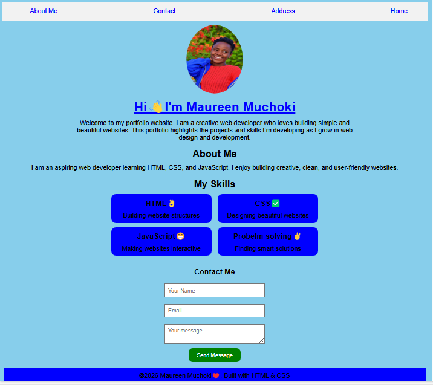
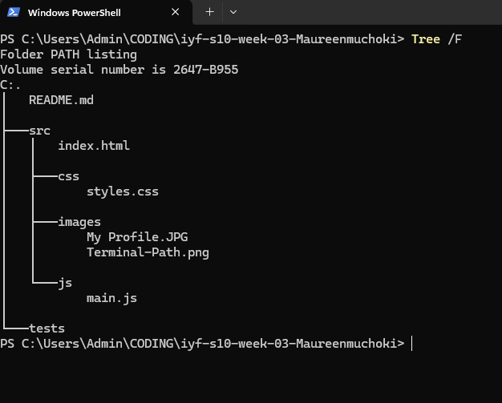

# Week 3: Tools & Workflow
# Maureen Muchoki - Week 03 Project

## Author
- **Name:** Maureen Muchoki
- **GitHub:** [@Maureenmuchoki](https://github.com/maureenmuchoki-hub)
- **Date:** March 13, 2026

## Project Description
This is my Week 3 portfolio project for IYF S10. This project demonstrates my ability to use the terminal, Git, and GitHub to create a well-structured portfolio. I practiced file management, Git workflow, branching, and professional README creation.

## Technologies Used
- HTML5
- CSS3 (Flexbox, Grid)
- JavaScript
- Git & GitHub

## Features
- ✅ Responsive design
- ✅ Accessible (WCAG compliant)
- ✅ Multi-page layout
- ✅ Contact form

## How to Run
1. Clone this repository
2. Open `index.html` in your browser
   OR
   Run `npm install` then `npm start`

## What I Learned
- Navigating the terminal efficiently and managing files without GUI.  
- Initializing Git repositories, staging files, making commits, and pushing to GitHub.  
- Creating and merging branches, handling merge conflicts.  
- Writing professional README files and organizing project structure.  
- Using `find` and `grep` commands to search for files and content.

## Future Improvements
- [ ] Add more JavaScript interactivity (e.g., dynamic portfolio filtering).  
- [ ] Implement dark mode.  
- [ ] Add more pages for projects and skills.  

## Screenshots






## Project Structure

```
iyf-s10-week-03-Maureenmuchoki/
├── README.md
└── src/
    ├── index.html
    ├── address.html
    ├── css/
    │   └── styles.css
    ├── js/
    │   └── main.js
    └── images/
        ├── My Profile.JPG
        ├── Terminal-Path.png
        └── My-Profile-Page.png
```

## Contact

- Email: nyamburamaureen2000@gmail.com  
- LinkedIn: [Maureen Muchoki](https://linkedin.com/in/maureen-muchoki-0292283b3/)
- GitHub: [@MaureenMuchoki](https://github.com/maureenmuchoki-hub)

## Live Demo

[View Live Site](https://maureenmuchoki-hub.github.io/iyf-s10-week-03-Maureenmuchoki/)

[My Portfolio](https://maureenmuchoki-hub.github.io/iyf-s10-week-03-Maureenmuchoki/src/index.html)

## License

This project is open source and available under the [MIT License](LICENSE).
